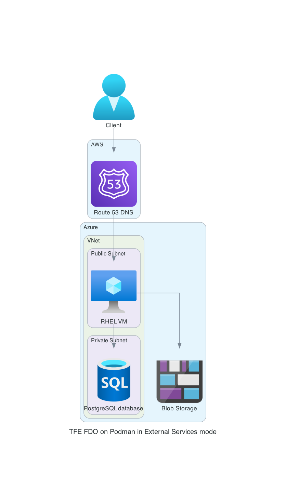

# Terraform Enterprise Flexible Deployment Options in External Services mode on Podman (Azure)
This repository creates a new installation of TFE FDO in External Services mode on Podman (Azure)

# Prerequisites
* Install [Terraform](https://developer.hashicorp.com/terraform/tutorials/aws-get-started/install-cli)

* Azure account
  
* AWS account (required for DNS)

* TFE FDO license

# Diagram



# How To

## Clone repository

```
git clone https://github.com/dmitryuchuvatov/terraform-azure-tfe-fdo-podman-es-si.git
```

## Change folder

```
cd terraform-azure-tfe-fdo-podman-es-si
```

## Rename the file called `terraform.tfvars-sample` to `terraform.tfvars` and replace the values with your own.
The current content is below:

```
environment_name    = "azure-tfe-fdo-podman-es-si"               # Name of the environment, used in naming of resources
region              = "West Europe"                              # Azure region to deploy in
vnet_cidr           = "10.200.0.0/16"                            # The IP range for the VPC in CIDR format
admin_username      = "adminuser"                                # Admin username to access the TFE instance via SSH
postgresql_user     = "postgres"                                 # PostgreSQL admin username
postgresql_password = "Password1#"                               # PostgreSQL admin password
storage_name        = "mytfestorageaccount"                      # Name used to create storage account. Can contain ONLY lowercase letters and numbers; must be unique across all existing storage account names in Azure"
tfe_release         = "1.1.3"                                    # TFE release version (https://developer.hashicorp.com/terraform/enterprise/releases)
tfe_password        = "Password1#"                               # TFE encryption password
tfe_license         = "02MV4UU..."                               # Value from the license file

# AWS setting for Route53 DNS and SSL certificate
aws_region        = "eu-west-3"                                  # AWS region to deploy in
route53_zone      = "dmitry-uchuvatov.aws.sbx.hashicorpdemo.com" # The domain of your hosted zone in Route 53
route53_subdomain = "azure-tfe-fdo-podman-es-si"                 # The subomain of the URL 
cert_email        = "dmitry.uchuvatov@hashicorp.com"             # TFE encryption password                                       
```

## Authenticate to Azure and AWS

For example,

```
az login --tenant ...
```

and

```
export AWS_ACCESS_KEY_ID=
export AWS_SECRET_ACCESS_KEY=
export AWS_SESSION_TOKEN=
```

## Terraform init
```
terraform init
```

## Terraform apply

```
terraform apply
```

When prompted, type **yes** and hit **Enter** to start provisioning AWS infrastructure and install TFE on it.

After some time, you should see the similar result:

```
Apply complete! Resources: 28 added, 0 changed, 0 destroyed.

Outputs:

ssh_login = "ssh adminuser@135.236.14.237"
tfe_url = "https://azure-tfe-fdo-podman-es-si.dmitry-uchuvatov.aws.sbx.hashicorpdemo.com"
```

## Next steps
It will take ~ 10 minutes to spin up TFE. You can verify this by clicking on the URL from the previous output.

When UI is accessible, [provision your first administrative user](https://developer.hashicorp.com/terraform/enterprise/flexible-deployments/install/initial-admin-user) and start using Terraform Enterprise.
